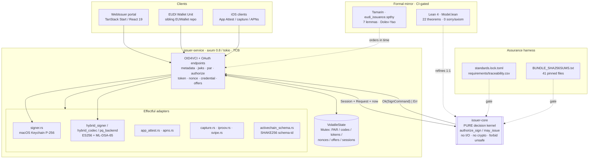
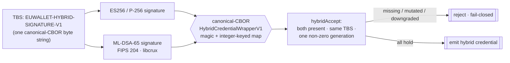
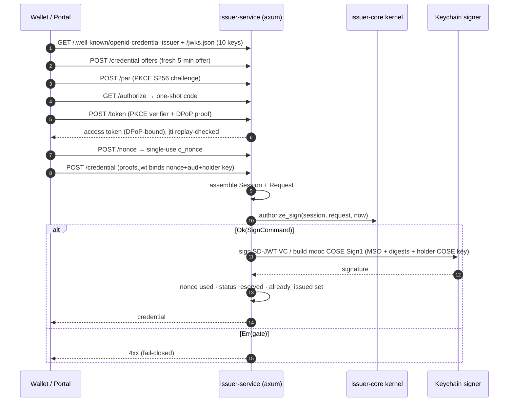
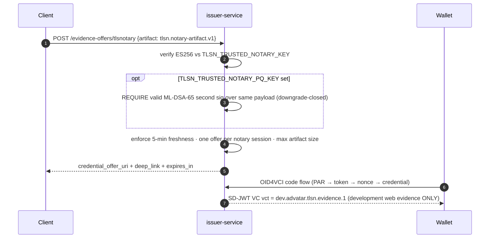
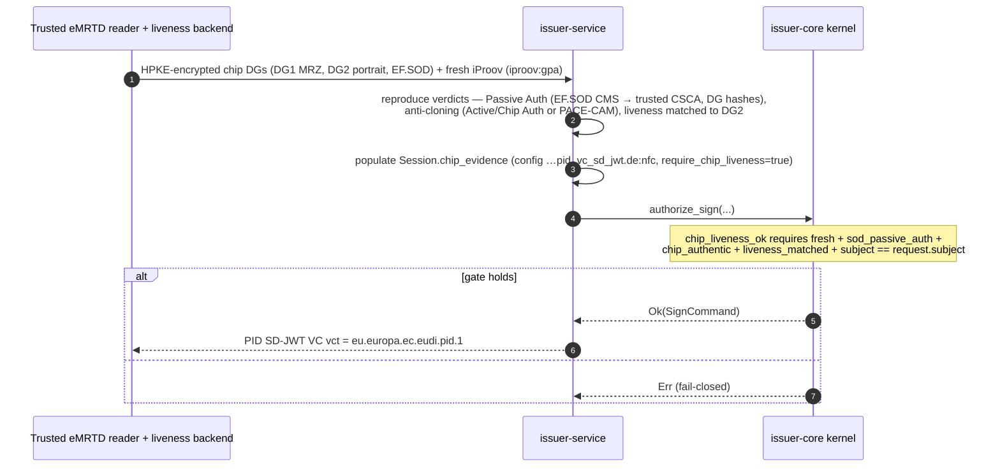
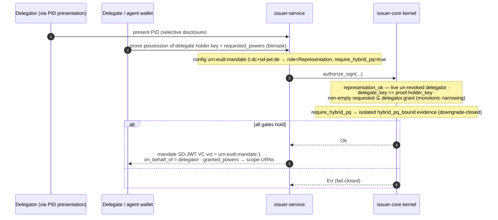
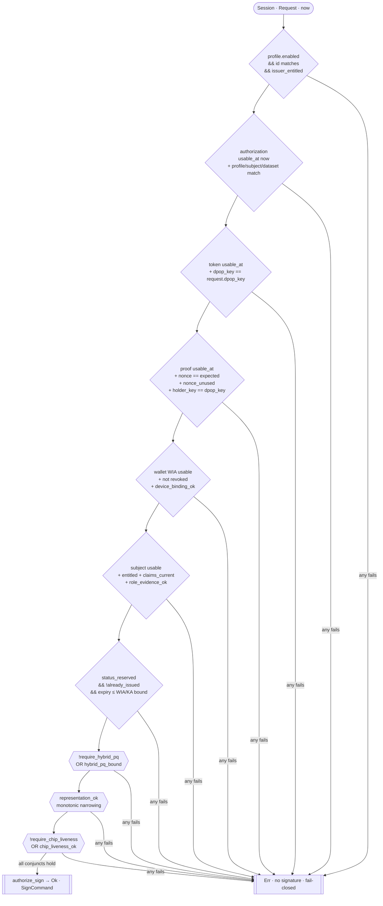
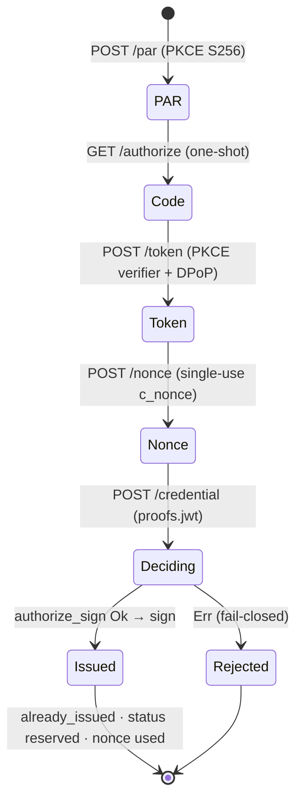
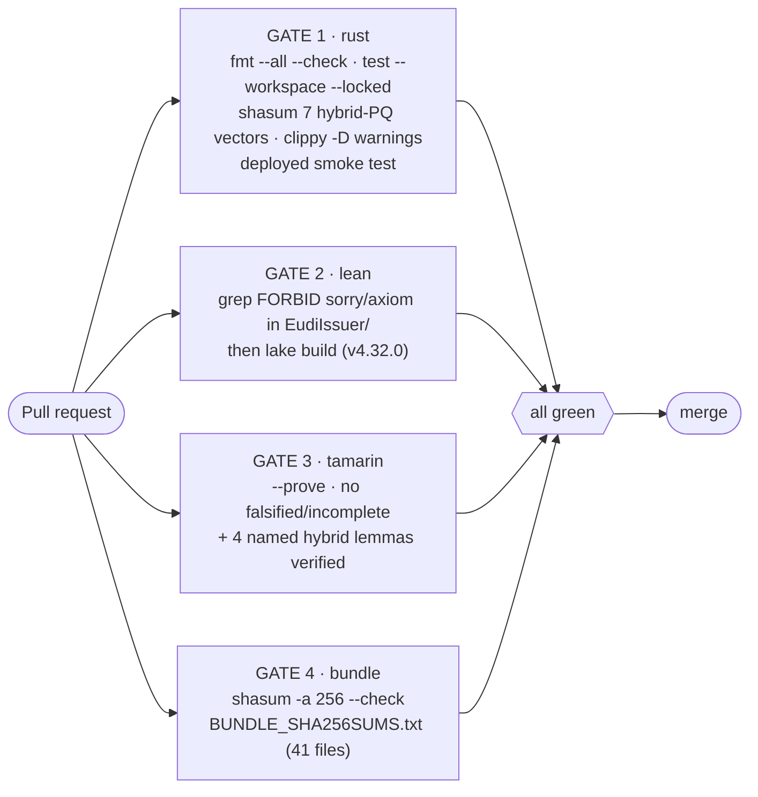
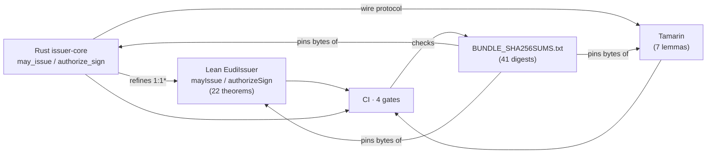

# VCIssuer — EUDI Formal Credential Issuer

**A from-scratch, formally-gated OpenID4VCI credential issuer in Rust: a tiny pure `authorize_sign` decision kernel, mirrored 1:1 in Lean 4 and analysed in Tamarin, wrapped by an axum HTTP service that issues German PID (SD-JWT VC + mdoc), an mDL, and learning (Q)EAA — plus experimental hybrid post-quantum, mandate delegation, NFC/eMRTD PID, TLSNotary web-evidence, Apple App Attest, and cross-wallet capture.**

[](https://joinup.ec.europa.eu/collection/eupl/eupl-text-eupl-12)
[](rust/Cargo.toml)
[](formal/lean/lean-toolchain)
[](rust/issuer-core/src/lib.rs)
[](.github/workflows/verify.yml)

Deployed development instance: **https://issuer.advatar.systems** · Source: **github.com/advatar/VCIssuer**

> **Status in one sentence:** this is a **formally-analysed *development* issuer**, not an externally certified one. See [Status & Roadmap](#status--roadmap) for exactly what is proven, what is experimental, and what gates remain.

---

## What & why

VCIssuer is an evidence-led German EUDI Credential Issuer / PID Provider / Attestation Provider. It issues credentials into EUDI Wallet Units over OpenID4VCI. The distinguishing idea is a deliberate **four-way separation of evidence**, each independently checkable:

1. **Normative traceability** — a pinned standards manifest ([`standards.lock.toml`](standards.lock.toml)) + a requirements-to-evidence matrix ([`requirements/traceability.csv`](requirements/traceability.csv)).
2. **Semantic correctness** — a total issuer decision predicate specified in Lean 4 ([`formal/lean/EudiIssuer/Model.lean`](formal/lean/EudiIssuer/Model.lean)).
3. **Protocol security** — a Tamarin symbolic model under a Dolev-Yao attacker ([`formal/tamarin/eudi_issuance.spthy`](formal/tamarin/eudi_issuance.spthy)).
4. **Implementation conformance** — a small, pure, `#![forbid(unsafe_code)]` Rust kernel ([`rust/issuer-core/src/lib.rs`](rust/issuer-core/src/lib.rs)) that mirrors the Lean model 1:1, plus effectful adapters checked by conformance and adversarial tests.

**Every credential is signed only when the pure `authorize_sign(session, request, now)` gateway returns `Ok`.** That single choke point is the object the Lean safety theorems constrain and the Tamarin lemmas order in time.

**Intended role.** "Wallet issuer" here means a *Credential Issuer / PID Provider / Attestation Provider that issues into an EUDI Wallet Unit* — **not** the Wallet Provider that supplies the wallet solution. A deployment must select explicit issuer roles and credential rulebooks; there is no unconstrained "generic credential" production profile.

> **This repository does not contain an iOS/Android wallet.** The wallet, the NFC relay, and the capture apps live in the sibling **EUWallet** repository. VCIssuer is the *issuer + formal core + portal* only.

---

## Highlights

- **Single formally-gated signing choke point.** Every credential is minted only via the pure `const fn authorize_sign`. Its `may_issue` predicate is a ~30-conjunct decision covering profile-enabled, authorization/token/subject/wallet-evidence freshness windows, single-use nonce + `holder == DPoP` key binding, device binding, status reservation, no-double-issue, and role-specific gates.
- **Rust kernel mirrored 1:1 in Lean 4** (types + `mayIssue` + `authorizeSign`) with **22 machine-checked theorems**, CI-gated to contain **zero `sorry`/`axiom`**.
- **Tamarin symbolic protocol model with 7 verified lemmas** (authorization-precedes-issuance, evidence-precedes-issuance, credential-id injectivity, and four hybrid-issuance lemmas) under a Dolev-Yao attacker.
- **German PID in *both* SD-JWT VC** (`vct = eu.europa.ec.eudi.pid.1`) **and ISO-mdoc** (COSE `Sign1` + MSO + namespace digests + holder COSE-key binding + dev doc-signer chain), plus an **ISO 18013-5 mDL** and a learning **(Q)EAA** in independent and PID-bound variants.
- **Experimental hybrid post-quantum credential** (disabled by default, non-EUDI): atomic **ES256 AND ML-DSA-65** (FIPS 204, via `libcrux`) over one canonical-CBOR TBS, with logical-generation binding and downgrade rejection — byte-interop-tested against EUWallet.
- **Power-of-representation MANDATE delegation** (ARF Topic 29): a `Powers` bitmask + pinned scope-URN taxonomy with proven **monotonic narrowing** (`requested ⊆ delegator grant`), bound to the delegate/agent holder key, post-quantum-required.
- **NFC/eMRTD-sourced PID**: a downgrade-closed `chip_liveness_ok` gate requiring reproduced Passive Authentication against a trusted CSCA, an anti-cloning proof, and iProov portrait-matched liveness — subject-bound.
- **TLSNotary web-evidence offers**: verifies a bounded `tlsn.notary-artifact.v1` (ES256, or downgrade-closed hybrid ES256+ML-DSA-65 when a PQ notary key is configured), 5-minute window + one offer per session, carried through the OID4VCI code flow.
- **Apple platform integration**: App Attest with per-mutation assertion binding + persisted replay counters; AASA + App Clip for cross-wallet PID capture; APNs push on capture-issued.
- **Reproducible assurance bundle**: [`BUNDLE_SHA256SUMS.txt`](BUNDLE_SHA256SUMS.txt) pins **41 evidence files** to SHA-256, checked as a CI gate — binding proofs to exact bytes.

---

## Architecture

Two Rust crates with a **pure kernel at the center**. `issuer-core` (≈800 LOC) makes the decision; `issuer-service` (≈9k LOC) does all the I/O and crypto and is the trusted computing base. The Lean model and Tamarin theory mirror the kernel; the standards/traceability manifests feed CI.



**Deployment topology.** A Mac-hosted issuer (the Keychain signer) sits behind a [Caddy reverse proxy](deploy/macos/Caddyfile) + a [launchd plist](deploy/macos), exposed over an authenticated Cloudflare Tunnel. The signer *cannot* run unchanged on Supabase Edge (Deno/TypeScript) or a Linux container — it signs through macOS Security.framework and would need a separately reviewed production key provider (HSM). See [Security notes](#security-notes).

---

## How it's built (design decisions)

**Kernel-and-adapter split.** `issuer-core` is deliberately pure: value types plus three `const fn` predicates, `may_issue → authorize_sign`, and the sub-gates `role_evidence_ok`, `device_binding_ok`, `representation_ok`, `chip_liveness_ok`. No I/O, no crypto, `#![forbid(unsafe_code)]`. All the messy, effectful work — parsing, DPoP/PKCE/PAR/nonce verification, credential assembly, and signing — lives in `issuer-service` *outside* the kernel. This is what makes the kernel a tractable refinement target and keeps the trust argument small: the thing that decides whether to sign is ~800 lines of side-effect-free Rust.

**Fail-closed downgrade gates.** Every capability gate is *downgrade-closed*. A profile that sets `require_hybrid_pq` can never be issued on classical-only evidence; a profile that sets `require_chip_liveness` can never be issued without a verified chip read. These are conjuncts in `may_issue` (`!profile.require_X || X_ok(..)`), so absence of evidence fails the whole decision rather than silently downgrading.

**Formal mirroring (semantic + symbolic).** [`Model.lean`](formal/lean/EudiIssuer/Model.lean) restates the kernel types and `mayIssue`/`authorizeSign` in Lean 4 and proves safety theorems about them; [`eudi_issuance.spthy`](formal/tamarin/eudi_issuance.spthy) models the wire protocol under a Dolev-Yao attacker and proves ordering/injectivity lemmas. The two are complementary: Lean says *the decision is correct*, Tamarin says *the protocol cannot be tricked into reaching a bad decision*. CI forbids proof placeholders in Lean and rejects any falsified/incomplete Tamarin lemma.

**Intentional Rust-stricter-than-Lean seam.** The PID-binding conjunct in `may_issue` (`!pid_binding_required || subject.pid_binding_verified`), used by the mandate and PID-bound-QEAA flows, is a **Rust-only guard**. Lean's `mayIssue` abstracts the credential-binding/delegation decision and does not model the wallet's PID-presentation adapter step. The correspondence is faithful on the modelled gates but is **not a full 1:1** — Rust is strictly stricter here, fail-closed. This is documented in the source, not hidden.

**Hybrid-PQ envelope.** The experimental hybrid credential is *not* SD-JWT VC or mdoc — it is a canonical-CBOR `HybridCredentialWrapperV1` (magic bytes + integer-keyed map). Both ES256 (`p256`) and ML-DSA-65 (`libcrux`) sign the **exact same** `EUWALLET-HYBRID-SIGNATURE-V1` TBS, and the acceptance predicate requires both components, the same TBS, and one non-zero logical generation — so removing or downgrading a component fails closed. The ML-DSA secret is AES-256-GCM-wrapped under a Keychain item and unwrapped only for the signing op, then zeroized.



**Schema-id derivation.** Each non-hybrid config publishes an `activechain_schema_id_v1` derived by a length-prefixed SHAKE256 profile shared with ActiveChain P-096 ([`activechain_schema.rs`](rust/issuer-service/src/activechain_schema.rs)). Unknown configs get no mapping; callers cannot supply or override the id.

**Volatile state, on purpose.** All session state (PAR requests, one-shot codes, tokens, nonces, DPoP/binding jtis, offers, TLSN sessions, capture sessions, App Attest challenges/instances) lives in a `VolatileState` behind a `tokio::Mutex` (App Attest instances optionally persist to disk). This is a development store, not a durable production one.

---

## Build & Run

Toolchains: **Rust 1.97 (edition 2024, resolver 3)**, **Lean 4.32.0** (pinned in [`lean-toolchain`](formal/lean/lean-toolchain)), **Tamarin** + Maude, **Bun** for the portal. The Rust signer requires **macOS** (Security.framework / Keychain).

### Run the issuer (macOS, development)

```sh
cd rust
LISTEN_ADDR=127.0.0.1:18080 \
ISSUER_URL=http://127.0.0.1:18080 \
TLSN_TRUSTED_NOTARY_KEY=<hex-uncompressed-sec1-p256-pubkey> \
RUST_LOG=issuer_service=info \
cargo run -p issuer-service
```

An optional `.env` is supported (process env wins); see [`rust/.env.example`](rust/.env.example).

### Optional feature switches (all fail-closed when unset)

| Env | Effect |
| --- | --- |
| `ENABLE_EXPERIMENTAL_HYBRID_PQ=true` | Exposes **only** `dev.advatar.hybrid-pq.sd-jwt.v1` (format `dev-hybrid-pq+cbor`). Disabled by default; non-EUDI. |
| `ENABLE_TLSN_DEMO` | Enables the `/dev/tlsnotary/demo-offer` development endpoint. |
| `TLSN_TRUSTED_NOTARY_PQ_KEY` | Requires a second ML-DSA-65 notary signature (downgrade-closed hybrid notary). |
| *trusted eMRTD-reader key* | Enables the NFC-sourced PID path. |
| `MANDAMUS_IPROOV_BASE_URL` / `_API_KEY` / `_SECRET` | Capture-flow liveness (fail-closed if unset). |
| App Attest config + `APP_ATTEST_STORE_PATH` | Enables App Attest register/assert + persistence. |
| APNs config | Enables push on capture-issued. |

### Tests, lint, proofs

```sh
# Workspace tests (issuer-core: 23 unit tests; issuer-service: ~65 test fns across modules)
cd rust && cargo test --workspace --locked

# macOS Keychain integration tests (create/access persistent Keychain material — run explicitly)
cd rust && cargo test --workspace -- --ignored     # 3 #[ignore] tests

# Lint — CI gate, zero tolerance (workspace lints: clippy all+pedantic=warn, unsafe_code=deny)
cd rust && cargo +1.97.0 fmt --all --check \
        && cargo +1.97.0 clippy --workspace --all-targets --locked -- -D warnings

# Lean proofs (CI also greps to forbid any sorry/axiom in EudiIssuer/)
cd formal/lean && lake build

# Tamarin proofs — all 7 lemmas must verify, none falsified/incomplete
cd formal/tamarin && tamarin-prover eudi_issuance.spthy --prove

# Hybrid-PQ evidence gate (reproduces shared vectors + proofs)
tools/evidence/verify-hybrid-pq.sh

# Assurance bundle integrity (41 tracked evidence files)
shasum -a 256 --check BUNDLE_SHA256SUMS.txt
```

### WebIssuer portal (git submodule)

```sh
cd WebIssuer && bun install
VITE_ISSUER_URL=https://issuer.advatar.systems bun run dev -- --host 127.0.0.1 --port 3000
bun run lint && bun run build   # TanStack Start + Vite, builds for Cloudflare
```

Open `http://127.0.0.1:3000`. The portal requests a **fresh, five-minute** OpenID4VCI offer per QR code (no static offers) and defaults to the deployed `https://issuer.advatar.systems` backend. HTTPS Lovable origins and local dev origins are accepted; other hosted UI origins must be listed exactly in the issuer's comma-separated `CORS_ORIGINS`.

### Smoke-test the deployed dev instance

```sh
curl https://issuer.advatar.systems/.well-known/openid-credential-issuer   # signed_metadata is a 3-part JWT
curl https://issuer.advatar.systems/jwks.json                              # 10 keys
```

---

## Key flows

### 1 — Baseline OpenID4VCI authorization-code issuance (PID / mDL / QEAA)



### 2 — TLSNotary web-evidence offer (classical or hybrid-PQ)



### 3 — NFC/eMRTD-sourced PID issuance



### 4 — Power-of-representation MANDATE delegation (ARF Topic 29)



Cross-wallet PID capture (`/v1/pid-capture/*` → App Clip via AASA/QR → iProov → capture-issued → APNs push), Apple App Attest per-mutation binding (`/v1/app-attest/{challenge,register,assert}`), and experimental hybrid-PQ issuance follow the same kernel-gated pattern; see [`STATUS.md`](STATUS.md) and [`FORMAL_SPEC.md`](FORMAL_SPEC.md).

### The `may_issue` decision (the choke point)



### Issuance session lifecycle



---

## Repository layout

```
VCIssuer/
├── rust/                        Cargo workspace (edition 2024, rust 1.97, resolver 3, EUPL-1.2)
│   ├── issuer-core/             PURE decision kernel — no I/O, no crypto, forbid(unsafe)
│   │   └── src/lib.rs           may_issue / authorize_sign + sub-gates (804 LOC, 23 tests)
│   └── issuer-service/          axum HTTP service + effectful adapters
│       ├── src/main.rs          OID4VCI/OAuth endpoints + assembly (4987 LOC, 19 tests)
│       ├── src/signer.rs        macOS Keychain P-256 signer + rcgen dev chains
│       ├── src/hybrid_signer.rs · hybrid_codec.rs · pq_backend.rs   ES256 + ML-DSA-65
│       ├── src/app_attest.rs    Apple App Attest P-384 x5c chain (532 LOC, 8 tests)
│       ├── src/capture.rs · iproov.rs · svipe.rs · apns.rs
│       ├── src/activechain_schema.rs · env_file.rs
│       └── tests/vectors/       shared hybrid-PQ corpora (interop w/ EUWallet)
├── formal/
│   ├── lean/EudiIssuer/Model.lean       1:1 kernel mirror — 22 theorems (0 sorry/axiom)
│   └── tamarin/eudi_issuance.spthy      symbolic Dolev-Yao model — 7 lemmas
├── WebIssuer/                   git submodule (github.com/advatar/just-issuer): TanStack Start portal
├── docs/                        experimental-hybrid-pq-profile · hybrid-pq-verification-report
│                                · hybrid-pq-dependency-evidence · svipe-development-profile
├── requirements/traceability.csv        seed requirement→evidence matrix (27 rows, not exhaustive)
├── testing/vectors/             cross-repo conformance corpora (ActiveChain / EUWallet)
├── schemas/credential-profile.schema.json
├── ci/                          maude-runner-wrapper + README
├── deploy/macos/                Caddyfile + launchd plist
├── scripts/check-identity-bridge-corpus.py
├── tools/evidence/verify-hybrid-pq.sh
├── .github/workflows/verify.yml         4-gate CI (self-hosted macOS ARM64)
├── standards.lock.toml          immutable manifest (production_ready=false, blank digests)
├── BUNDLE_SHA256SUMS.txt         41 pinned evidence files
└── FORMAL_SPEC.md · ASSURANCE_CASE.md · THREAT_MODEL.md · STATUS.md · AGENTS.md
```

### HTTP surface (issuer-service)

| Method · Path | Purpose |
| --- | --- |
| `GET /health` | Liveness. |
| `GET /.well-known/openid-credential-issuer` | Issuer metadata (`signed_metadata` = 3-part JWT). |
| `GET /.well-known/oauth-authorization-server` | AS metadata. |
| `GET /.well-known/apple-app-site-association` | AASA for App Clip / universal links. |
| `GET /jwks.json` | Issuer JWKS (10 keys). |
| `POST /credential-offers` · `GET /credential-offer/{id}` | Fresh 5-minute offers. |
| `POST /par` · `GET /authorize` · `POST /token` · `POST /nonce` | OAuth: PAR, one-shot code, DPoP-bound token, single-use nonce. |
| `POST /credential` | Credential issuance (kernel-gated). |
| `GET /credential-signing-certificates/{configuration_id}` | Dev signer cert chain. |
| `POST /evidence-offers/tlsnotary` | TLSNotary web-evidence offer. |
| `POST /dev/tlsnotary/demo-offer` | Dev-only TLSN demo (behind `ENABLE_TLSN_DEMO`). |
| `GET /experimental/hybrid-pq/profile` | Hybrid-PQ profile descriptor (experimental). |
| `POST /v1/app-attest/{challenge,register,assert}` | Apple App Attest. |
| `POST /v1/notifications/register` | APNs registration. |
| `POST /v1/pid-capture/session` · `GET /v1/pid-capture/{id}` · `POST /v1/pid-capture/{id}/evidence` | Cross-wallet capture. |

---

## Testing & formal assurance

Four PR-based CI gates in [`.github/workflows/verify.yml`](.github/workflows/verify.yml), all on a **self-hosted macOS ARM64 runner** (label `vcissuer`) because signing uses Security.framework.



**Concrete counts (grounded in current sources):**

| Evidence | Count | Where |
| --- | --- | --- |
| Lean `theorem` declarations | **22** | `formal/lean/EudiIssuer/Model.lean` |
| Tamarin lemmas (all verified) | **7** | `formal/tamarin/eudi_issuance.spthy` |
| `issuer-core` unit tests | **23** | `rust/issuer-core/src/lib.rs` |
| `issuer-service` test fns | **~65** across modules | `hybrid_codec` 10 · `app_attest` 8 · `iproov` 7 · `env_file` 5 · `capture` 4 · `activechain_schema` 3 · `main` 19 · others |
| macOS Keychain integration tests | 3 (`#[ignore]`) | run explicitly |
| Pinned assurance-bundle files | **41** | `BUNDLE_SHA256SUMS.txt` |

**Lean theorems** (`Model.lean`) include: soundness (`authorizeSign_sound`), `disabled_profile_cannot_sign`, security-gate / nonce / holder-binding / status theorems, PID LoA-high (`pid_authorizeSign_requires_loa_high`), WIA/KA maintenance bound; the delegation suite (`representation_authorizeSign_narrows_and_binds`, `representation_without_delegation_cannot_sign`, `mayIssue_representationOk`, `authorizeSign_requires_hybrid_pq_when_profile_requires`); the NFC-PID suite (`chip_liveness_pid_authorizeSign_binds_verified_chip`, `authorizeSign_requires_chip_liveness_when_profile_requires`, `mayIssue_chipLivenessOk`); and the hybrid suite (`authorizeHybridSign_sound` + AND-policy / same-TBS / generation-agreement / downgrade-rejection theorems).

**Tamarin lemmas** (all verifying): `issuance_requires_matching_authorization`, `issuance_requires_matching_evidence`, `credential_identifier_injective`, plus the four hybrid lemmas `hybrid_issuance_is_atomic`, `hybrid_components_sign_same_tbs`, `classical_component_removal_is_rejected`, `hybrid_generation_agreement`.



\* One documented exception: the PID-binding conjunct is Rust-only and strictly stricter than Lean (see [How it's built](#how-its-built-design-decisions)).

**Scope of the proofs (important).** The Lean model and Tamarin theory establish **only** their explicit semantic-model and symbolic-protocol scopes. They do **not** prove ES256/ML-DSA arithmetic, the CBOR parser, Security.framework, or the network adapters. Those are covered by contracts, unit/conformance tests, shared byte-identical vectors, and operational assurance.

**Cross-repo interop** is enforced with byte-identical vectors shared with EUWallet (hybrid-PQ TBS/component/wrapper corpora with 12+21 rejection mutations) and an identity-bridge conformance corpus shared with ActiveChain/EUWallet. Supporting evidence: [`docs/hybrid-pq-verification-report.md`](docs/hybrid-pq-verification-report.md), [`docs/hybrid-pq-dependency-evidence.md`](docs/hybrid-pq-dependency-evidence.md) (ML-DSA dependency review, SBOM delta, RustSec, key custody).

> Prior task history references criterion benchmarks, `cargo-mutants` mutation testing, and a CycloneDX SBOM. These were **not all located under VCIssuer paths** during this pass — treat them as not-present-here unless you find them in-tree.

---

## Standards & conformance

Referenced/implemented (development-qualified where noted); the authoritative pin is [`standards.lock.toml`](standards.lock.toml).

- **OpenID4VCI 1.0 Final**; **OpenID4VC High Assurance Interoperability Profile (HAIP) 1.0 Final**.
- **OAuth 2.0**: PAR (RFC 9126), PKCE S256 (RFC 7636), DPoP (RFC 9449), AS metadata.
- **EUDI ARF 2.9.0**, incl. **Topic 29** power-of-representation / mandate.
- **EC TS03 — Wallet Unit Attestations (WIA/KA) 1.5.2** (referenced/assumed at kernel level).
- **SD-JWT VC** (IETF) with RFC 7638 JWK thumbprints.
- **ISO/IEC 18013-5 mdoc / mDL** (COSE `Sign1`, MSO, namespace digests, `mso_mdoc`).
- **IETF Token Status List**.
- Applicable **EUDI PID / Attestation Rulebooks** — *development-qualified pending exact editions*.
- **ETSI TS 119 472-3**, **ETSI TS 119 412-6**; EUDI/ENISA cryptographic-mechanisms profile.
- **FIPS 204 ML-DSA-65** (experimental hybrid PQ, via `libcrux-ml-dsa`); **ES256/P-256** baseline, **ES384/P-384** (App Attest chain).
- **ICAO Doc 9303 eMRTD** (Passive Authentication, Active/Chip Authentication / PACE-CAM) for NFC-sourced PID.
- **Apple App Attest**, **AASA / App Clips**, **APNs**.
- **TLSNotary** (`tlsn.notary-artifact.v1` development contract).
- **ActiveChain P-096** length-prefixed SHAKE256 schema-id derivation (cross-repo).

---

## Security notes

- **Trusted computing base** is `issuer-service` + the signer + adapters, enumerated in [`THREAT_MODEL.md`](THREAT_MODEL.md) (T-001…T-030 + attacker classes) and [`ASSURANCE_CASE.md`](ASSURANCE_CASE.md).
- **All gates are fail-closed.** The kernel signs only on `Ok`; every downgrade gate (`require_hybrid_pq`, `require_chip_liveness`) rejects when its evidence is absent.
- **DPoP / PKCE / nonce.** Access tokens are DPoP-bound with jti replay detection; authorization codes are one-shot; `c_nonce` is single-use; the credential-proof `holder_key` must equal the DPoP key.
- **Hosting boundary.** The macOS Keychain signer is **development-only**. It cannot move unchanged to Supabase Edge Functions (Deno/TypeScript) or a Cloudflare/Linux container. A container deployment requires a separately reviewed **production key provider (HSM)**. The compatible no-HSM dev topology is a Mac-hosted issuer behind an authenticated Cloudflare Tunnel; Supabase may hold durable application state but must never receive raw private signing keys.
- **Production build safety interlock.** [`standards.lock.toml`](standards.lock.toml) has `production_ready = false` with blank `content_sha256` digests — **a production build MUST fail until every required digest is pinned.**
- **PQ key custody.** The ML-DSA secret is AES-256-GCM-wrapped under a Keychain item, unwrapped only for a signing op, then zeroized.
- **State is volatile.** In-memory session state is not a durable production store.

---

## Status & roadmap

This repository is scrupulously honest about scope; that framing is a core asset. The recommended precise claim:

> *For the explicitly identified safe-Rust issuer kernel, every reachable signing command refines the pinned Lean transition model, and the model proves the listed safety invariants. The Tamarin model proves the listed symbolic protocol properties under its stated cryptographic, PKI, time, revocation, and compromise assumptions. Runtime adapters and infrastructure are covered by explicit contracts, bounded checks, fuzzing, conformance suites, and operational assurance.*

**Fully implemented + machine-checked (baseline).**
OID4VCI / OAuth flow (PAR, PKCE S256, one-shot codes, DPoP ES256 verify + replay detection, credential nonces, JWT credential-proof verification), signed issuer metadata + AS metadata + 10-key JWKS, the pure `authorize_sign` kernel, Keychain-backed SD-JWT VC signing for German PID + learning profiles, and mdoc profiles (tagged issuer-signed items, namespace digests, holder COSE-key binding, MSO, COSE `Sign1` with a dev document-signer chain). The Lean model + Tamarin theory are CI-gated (zero `sorry`/`axiom`, all lemmas verified) — within their stated scopes only.

**Experimental / development-only (explicitly non-EUDI, isolated, must stay flagged).**
Hybrid post-quantum credential (`dev.advatar.hybrid-pq.sd-jwt.v1`, format `dev-hybrid-pq+cbor`, disabled by default — a canonical-CBOR ES256+ML-DSA-65 envelope that is **not** SD-JWT VC / mdoc / an EUDI credential); TLSNotary web-evidence (`vct dev.advatar.tlsn.evidence.1` — dev web evidence only, **never** PID / (Q)EAA / KYC); the `/dev/tlsnotary/demo-offer` endpoint.

**Profiled / partial.**
NFC/eMRTD-sourced PID and power-of-representation MANDATE delegation have **proven kernel gates (Lean + Rust) and service endpoints**, but depend on external trusted reader/liveness + delegator-PID-presentation adapters; the Rust `may_issue` is intentionally **stricter** than Lean on the PID-binding conjunct (fail-closed, documented as not a full 1:1). ActiveChain schema-ids/descriptors are **development-qualified** pending exact normative rulebook editions.

**Not done / gates remaining.**
German authority/CAB assessment; official OIDF/EUDI FCAF conformance suites; production trust anchors; an HSM-backed production key provider; operational assurance; and legal qualification. State is in-memory/volatile, not a durable production store.

---

## Contributing

Development is **PR-based**; all four CI gates (rust / lean / tamarin / bundle) run on the self-hosted macOS ARM64 runner and must pass. Before opening a PR:

1. `cd rust && cargo +1.97.0 fmt --all --check && cargo +1.97.0 clippy --workspace --all-targets --locked -- -D warnings && cargo test --workspace --locked`
2. If you touched the kernel, update **both** `rust/issuer-core/src/lib.rs` **and** `formal/lean/EudiIssuer/Model.lean` in the same change, and keep `cd formal/lean && lake build` green (no `sorry`/`axiom`).
3. If you touched the protocol, re-run `tamarin-prover eudi_issuance.spthy --prove` (all 7 lemmas verified).
4. If you changed any pinned evidence file, **regenerate `BUNDLE_SHA256SUMS.txt`** (`shasum -a 256 --check` is a gate).
5. Preserve the honesty conventions: never upgrade an experimental/development capability's wording to imply EUDI/production status.

Start here: [`FORMAL_SPEC.md`](FORMAL_SPEC.md) · [`standards.lock.toml`](standards.lock.toml) · [`requirements/traceability.csv`](requirements/traceability.csv) · [`formal/lean/EudiIssuer/Model.lean`](formal/lean/EudiIssuer/Model.lean) · [`formal/tamarin/eudi_issuance.spthy`](formal/tamarin/eudi_issuance.spthy) · [`rust/issuer-core/src/lib.rs`](rust/issuer-core/src/lib.rs) · [`ASSURANCE_CASE.md`](ASSURANCE_CASE.md) · [`THREAT_MODEL.md`](THREAT_MODEL.md).

---

## License

**EUPL-1.2** (European Union Public Licence). Declared in [`rust/Cargo.toml`](rust/Cargo.toml) (`workspace.package.license`). See the [EUPL-1.2 text](https://joinup.ec.europa.eu/collection/eupl/eupl-text-eupl-12).
